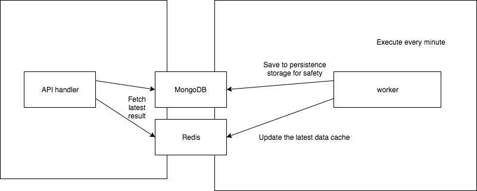

# Cryptocurrency Real Time Price Check

A simple view to show most cryptocurrency price in USD

## Design



## Development Setup

Make sure you have docker installed, then

```bash
cd ${this_project_folder}
cp .env.sample .env
docker-compose up -d
```

It will take some time to build the docker images and react bundle.

Then the web is up at `http://localhost:${WEB_PORT}`, where `WEB_PORT` default is `8182`

The app server has watch mode on frontend source codes, the server will rebuild the bundle automatically when saved. Refresh to get the latest bundle.

To shut down:

```bash
docker-compose down
```
